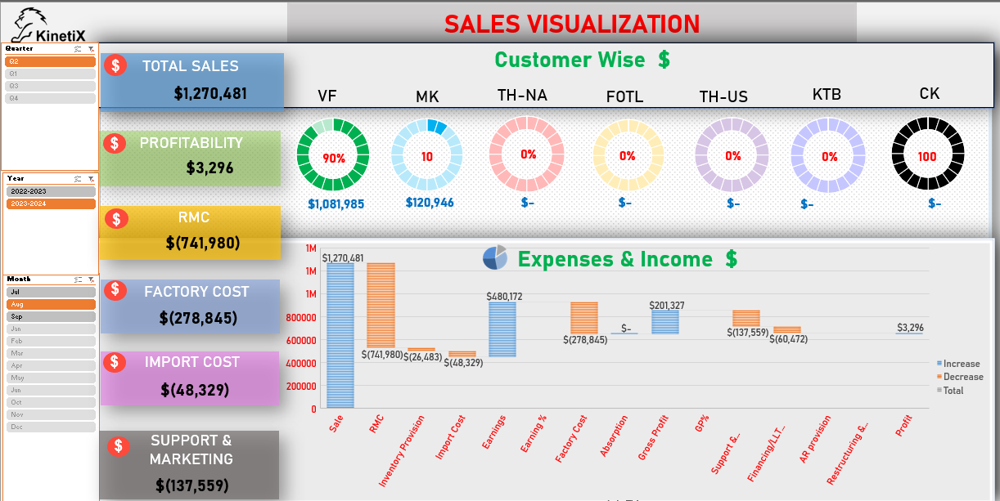

# Sales-Dashboard-Visualization

## 🔍 Objective
---
A sales visualization dashboard that summarizes **financial performance**, including *total sales*, *profitability*, *various costs (RMC, factory, import, support & marketing)*, and *customer-wise* contributions. 

It uses a bar chart to compare sales and expense categories, a pie chart to break down expenses and income, and circular graphs to show each customer's profit percentage for a specific quarter.

---

📁 [Download KinetiX Sales Dashboard](sales-dashboard-overall.xls)
---

---
